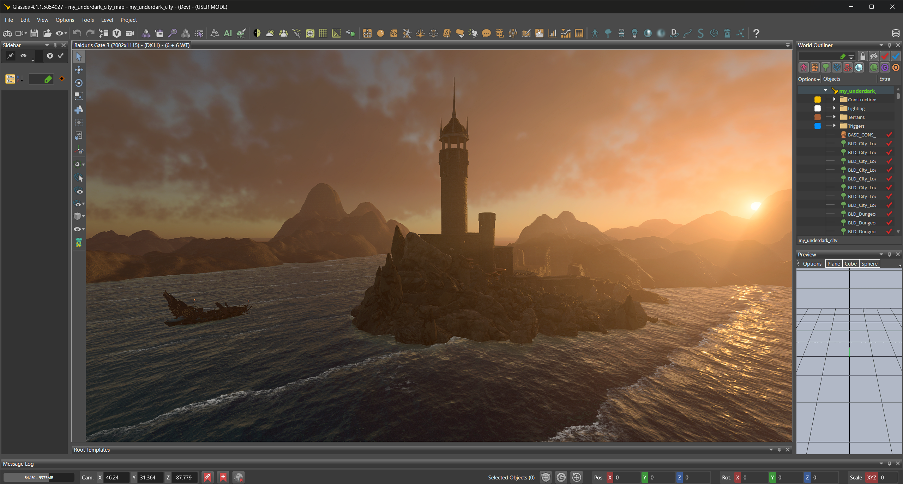

Baldurs Gate 3 Map Projects
=======

In September of 2024 I dabbled with the [Baldurs Gate 3](https://baldursgate3.game/) (which I can definitely recommend, it was great fun!) Mod Creation scene and made the first-ever community-created "maps" (environments) for this game.

## Sea Castle
This is the first map I made in their modding toolkit, which was [the **first** ever community-created map](https://www.reddit.com/r/BaldursGate3/comments/1ffuhay/custom_map_created_using_unlocked_toolkit/).

▶️ Video links [here](https://youtu.be/_LOF3d7aLZ0?si=4RnMbY207fOfH1kM) and [here](https://youtu.be/O9uEtt3Ej8M?si=nYYsvqLBhGDUX4O1)

## Avernus

Subsequently I also made another themed environment that the community of this game quite appreciated: [initial post](https://www.reddit.com/r/BaldursGate3/comments/1fi2l08/avernus_caelidinspired_map_using_the_unlocked/), [progress update](https://www.reddit.com/r/BaldursGate3/comments/1fnn5s8/avernus_caelid_custom_map_mod_progress/).

▶️ Video links (sorted by progress): [video 1](https://www.youtube.com/watch?v=5UoBYo4iJv4), [video 2](https://www.youtube.com/watch?v=X1KwYIs0FbM&), [video 3](https://www.youtube.com/watch?v=Kw-x5eWnPSc), [video 4](https://www.youtube.com/watch?v=wKBkko6KJhA), [video 5](https://www.youtube.com/watch?v=W0hGxIy2xsc)

🖼️ (You can find more pictures than I've shared publicly prior to this in the folder [`pictures`](./pictures/))

## Publicity
### Apparently, this was interesting enough that a bunch of video game journalists wrote articles about it 😲:

- ["Baldur's Gate 3 Modder Reveals First Custom Maps, Including Avernus" (**IGN**)](https://www.ign.com/articles/baldurs-gate-3-modder-reveals-first-custom-maps-including-avernus)
- ["After Baldur's Gate 3 modders made custom maps possible, someone's already working on their own version of Avernus" (**VG247**)](https://www.vg247.com/baldurs-gate-3-modders-made-custom-maps-possible-someone-working-on-avernus)
- ["Baldur's Gate 3 modders are already using its jailbroken level editor to make the game's first custom maps, including a proof-of-concept level in Hell" (**PCGAMER**)](https://www.pcgamer.com/games/baldurs-gate/baldur-s-gate-3-modders-are-already-using-its-jailbroken-level-editor-to-make-the-game-s-first-custom-maps-including-a-proof-of-concept-level-in-hell/)
- ["Baldur's Gate 3's First Custom Maps Portend Endless D&D Adventure" (**Push Square**)](https://www.pushsquare.com/news/2024/09/baldurs-gate-3s-first-custom-maps-portend-endless-dandd-adventure)
- ["Baldur's Gate 3 Player Builds Custom Map" (**Game Rant**)](https://gamerant.com/baldurs-gate-3-player-custom-map/)
- And [a bunch more](https://www.google.com/search?q=baldurs+gate+3+custom+maps&sca_esv=60f97cbc684a995f&biw=2047&bih=990&sxsrf=AHTn8zo4V1JYPexw_mX6zbFT606msKi9Tg%3A1743677577671&source=lnt&tbs=cdr%3A1%2Ccd_min%3A9%2F1%2F2024%2Ccd_max%3A9%2F30%2F2024&tbm=nws)...

I did not end up going much further with this project due to personal priorities/job reasons and lack of time.

I'm sharing this publicly now for visibility.

As of now it is more or less certain that I will not pick this up any further, and so that anybody who might really feel like it could potentially pick up the work on this.

# Attribution
- [Baldur's Gate 3](https://store.steampowered.com/app/1086940/Baldurs_Gate_3/), a game by [Larian Studios](http://larian.com/)
- This export was generated by using this project [LaughingLeader/SourceControlGenerator](https://github.com/LaughingLeader/SourceControlGenerator)
